# Unsupervised Robust Beta Estimation Using Bayesian Framework


## Introduction

The Beta [[1]](https://www.investopedia.com/articles/investing/102115/what-beta-and-how-calculate-beta-excel.asp) is a measure of the market risk of a given stock and it is used in valuation models. There are several different ways to compute it but traditionally it is computed by taking the covariance between the stock's and the market's return divided by the market's return variance. The problem of looking at this statistic as a measure for risk is that market returns can be very noisy and thus the final estimate is not very robust. The goal of this project is to find a more robust Beta for valuation purposes by creating a sensible estimator with a lower variance than the historical sample.

To create this estimator we will use two models. The simpler model looks at the recent years' values and fits a normal distribution. The more complex model uses a hierarchical approach and takes data of the sector to create a sector beta that reflects the risk related to the business where the company is inserted. This sector beta is the hyperparameter of the model and is then used to sample the company's beta parameters.

## Problem description

The problem with how betas are usually computed is that it does not necessarily reflect the risk that analysts are looking for when valuating a company. The ideal risk measure should not vary heavily throughout the years unless there is a business decision that justifies the shift. For instance, in recent years, Tesla started to be perceived as a technology firm instead of a car manufacturer [[2]](https://www.youtube.com/watch?v=8rZps01Ok7I) and this shift has changed the perspective of risk, expected growth, and expected return which are all directly and indirectly accounted for in the beta.

To get the data for this project we used **Yahoo Finance API** to get the historical prices of technology companies and we computed the betas by ourselves using monthly prices over a 5 year period. For the monthly prices, we opted for the median price of the stock to filter out some noise due to daily variations on the stock prices.

Previous studies have proposed Bayesian Models for calibrating the implied risk distribution for options valuation [[3]](https://projecteuclid.org/journals/bayesian-analysis/volume-10/issue-4/A-Bayesian-Beta-Markov-Random-Field-Calibration-of-the-Term/10.1214/15-BA960SI.full) our study proposes an unsupervised improvement to the stability of the company risk estimator for valuation purposes. Another useful study published in the journal of portfolio management explains how hard it is to measure success in valuating a company [[4]](https://jpm.pm-research.com/content/39/1/112.short) and thus the reason why we decided to evaluate our results as an unsupervised problem by looking at the robustness in terms of variance.

## Model description

### Non-hierarchical model

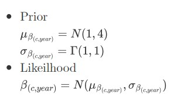

The prior of this model is chosen based on the assumption that the companies in our dataset are mature and the risk of mature companies tend to converge to the market risk and therefore to a beta of 1, so the mu_beta is normally distributed around 1 and has a standard deviation of 2. Note that for valuation purposes and using beta as a measure of risk it does not make sense to have negative values but for other applications beta can be negative. In any case, we applied the module operation to the observed data and this should guarantee that with this prior our estimates should be positive. The standard deviation of 2 should give enough uncertainty to the parameter to freely vary up to 3 times the market risk with a reasonable chance to happen. The prior chosen for the sigma_beta was a traditionally used weekly prior for variance estimators.


|                 Rhat distribution                  |                        Bulk ESS                         |
| :-----------------------------------------------------: | :-----------------------------------------------------: |
| 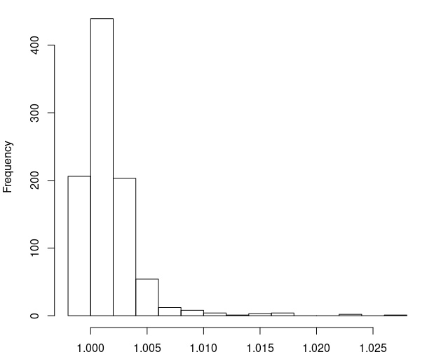 | 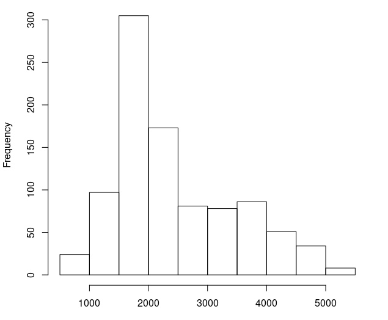 |

As we can observe from the above distribution the $\hat{R}$ values are smaller than 1.05 which means that the estimators of our model converged. It can be seen above from the results that the Bulk ESS is greater than 100 which is a good estimate.

### Hierarchical model

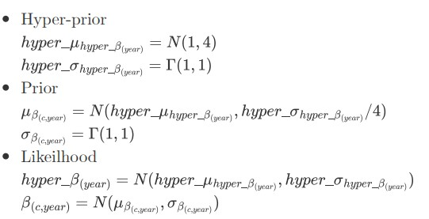

The hierarchical model uses the same distribution as the non-hierarchical model for its hyper-priors.

|                 Rhat distribution                  |                        Bulk ESS                         |
| :-----------------------------------------------------: | :-----------------------------------------------------: |
| 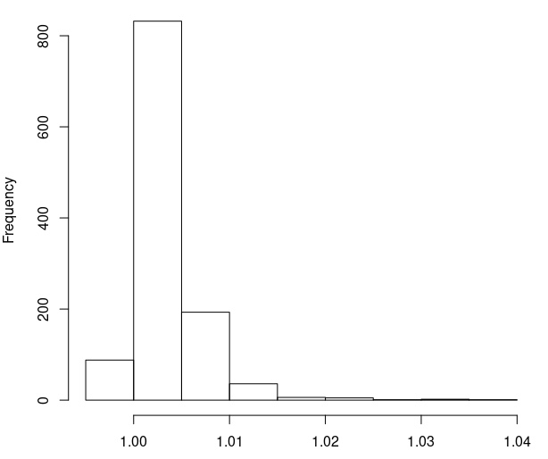 | 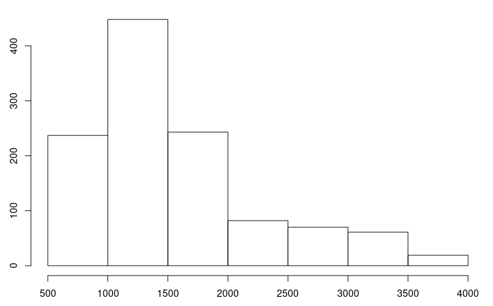 |

As we can observe from the above distribution the Rhat values are smaller than 1.05 which means that the estimators of our model converged. It can be seen above from the results that the Bulk ESS is greater than 100 which is a good estimate.

## RStan code

> Non hierarchical model
```c
data {
  int<lower=0> N;
  int <lower=0> ny;
  int yn;
  real <lower=0> b_acc[ny,N,yn];
  real <lower=0> mu_var;
  real <lower=0> mu_mu;
}
parameters {
  real mu[yn,ny];
  real<lower=0> sigma[yn,ny];
}
model {
  for(k in 1:yn)
  {
    for(i in 1:ny )
    {
      mu[k,i] ~ normal(mu_mu, mu_var);
      sigma[k,i] ~ gamma(1, 1);
      b_acc[i, ,k] ~ normal(mu[k,i], sigma[k,i]);
    }
  }
}
generated quantities {
  real post_b[yn,ny];
  real log_lik[ny,N,yn];
  for(k in 1:yn)
    {
    for(i in 1:ny)
    {
      post_b[k,i] = normal_rng(mu[k,i], sigma[k,i]);

      for (n in 1:N){
        log_lik[i,n,k] = normal_lpdf(b_acc[i,n,k] | mu[k,i], sigma[k,i]);
      }
    }
  }
}
```

> Hierarchical code

```c
data {
  int<lower=0> N;
  int<lower=0> ny;
  int<lower=0> yn;
  vector[ny] sector_beta[yn];
  real b_acc[ny,N,yn];
  real <lower=0> mu_var;
  real <lower=0> mu_mu;
}
parameters {
  real mu[yn,ny];
  real hyper_mu[yn,ny];
  real<lower=0> sigma[yn,ny];
  real<lower=0> hyper_sigma[yn,ny];
}
model {

  for(k in 1:yn)
  {
    for(i in 1:ny )
    {
      hyper_mu[k,i] ~ normal(mu_mu, mu_var);
      hyper_sigma[k,i] ~ gamma(1, 1);
      
      mu[k,i] ~ normal(hyper_mu[k,i], hyper_sigma[k,i]);
      sigma[k,i] ~ gamma(1, 1);
      
      sector_beta[k,i] ~ normal(hyper_mu[k,i], hyper_sigma[k,i]);
      b_acc[i, ,k] ~ normal(mu[k,i], sigma[k,i]);
    }
  }
}
generated quantities {

  real post_b[yn,ny];
  real log_lik[ny,N,yn];
  for(k in 1:yn)
  {
    for(i in 1:ny)
    {
      post_b[k,i] = normal_rng(mu[k,i], sigma[k,i]);
      for (n in 1:N){
        log_lik[i,n,k] = normal_lpdf(b_acc[i,n,k] | mu[k,i], sigma[k,i]);
      }
    }
  }
}
```


## Model comparison

As we described before the goal of the project is to have sensible and robust estimators of risk for valuation purposes. For this reason, we compare the models mainly by looking at the variance across the years (assuming no major business changes have happened to these companies). We also perform a cross-validation analysis to determine how sensible the model is to the observed data.

|                         Hierarchical                         |                       Non-hierarchical                       |
| :----------------------------------------------------------: | :----------------------------------------------------------: |
|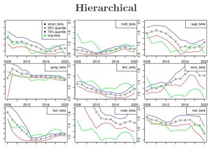 | 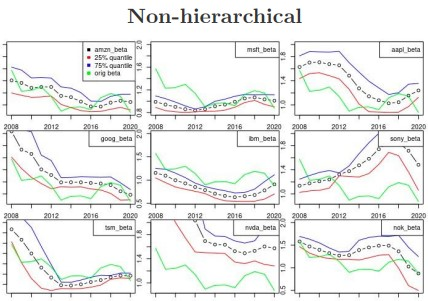 |
|   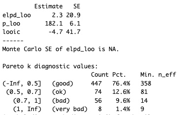    |   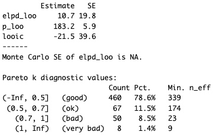    |

we observe that both the models succeed in reducing the variance over the years. Looking at the cross-validation results, the hierarchical models seem to be less sensitive to the observed data as expected. To determine which model is better, we would have to perform another study to assess whether the reduction in the observed data sensibility is due to filtering out market noise or whether we are losing information.


## Prior sensitivity analysis

To test the sensibility of the model to the prior we run different tests varying the parameters of the normal distribution of the mean prior for the non-hierarchical model and the hyper-mean prior for the hierarchical model. 

First, we changed the variance to 1 and 16. Then, we changed the mean to 2 and 5. The results were assessed visually we can observe them in the graphs below.

|                         Hierarchical                         |                       Non-hierarchical                       |
| :----------------------------------------------------------: | :----------------------------------------------------------: |
| 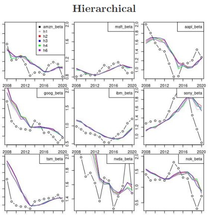 | 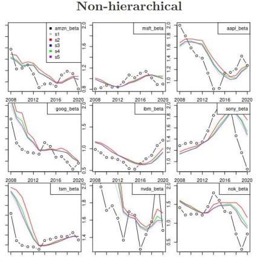 |


As we can see the model is not very sensitive to the prior choice as long as we keep it reasonable for the sector and maturity of the companies.

## Discussion of issues and potential improvements

At first, the idea of the project was to compare the impact of different betas in the valuation process and compare them to the current price of stocks. The improvement idea was to project the implied betas and calibrate them with the accounting beta. However, after collecting the balance sheet and cash flow statements for the companies over a 20 years period we realized that the data was incorrect and we did not have enough resources to clean and correct it.
The evaluation method could also be improved by using a single score. However, this would require a side methodological study to validate this proposal.

## Conclusion


The proposed models have achieved their goal to create more robust estimates of company risk. Both models had no problem to converge and they were also not very sensitive to the prior. The hierarchical model estimators were shown to be less sensitive to the observed data than the non-hierarchical one.


